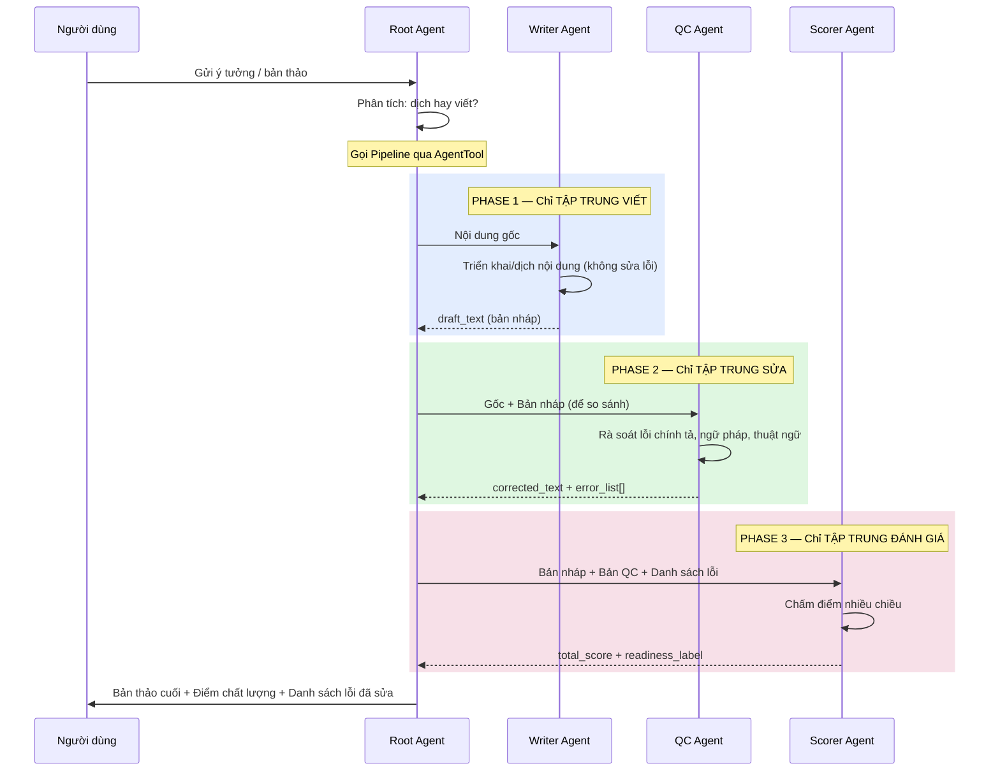

# Phần 3 — Sản phẩm bàn giao

## 1. Sơ đồ tư duy về luồng xử lý (Logic Flow)

### Tổng quan kiến trúc

Hệ thống sử dụng **Multi-Agent Architecture**:

```mermaid
flowchart TB
    subgraph User["👤 Người dùng"]
        INPUT["Gửi ý tưởng thô / bản thảo / outline"]
    end

    subgraph ROOT["Root Agent — Orchestrator"]
        DECIDE{"Phân tích yêu cầu"}
        CHAT["Trả lời trực tiếp"]
        CALL_PIPELINE["Gọi Pipeline qua AgentTool"]
        FORMAT["Format lại Markdown + Stream artifact"]
        EXPLAIN["Liệt kê lỗi & giải thích"]
    end

    subgraph PIPELINE["Editorial Pipeline (BaseAgent)"]
        direction TB
        
        subgraph PHASE1["Giai đoạn 1: Biên dịch / Phóng tác"]
            WRITER_DECIDE{"Dịch hay Triển khai?"}
            TRANSLATE["Translation Agent"]
            EXPAND["Creative Writing Agent"]
        end
        
        subgraph PHASE2["Giai đoạn 2: Kiểm soát chất lượng"]
            QC["QC Agent"]
            QC_INPUT["So sánh: Gốc ↔ Bản dịch/triển khai"]
            QC_OUTPUT["corrected_text + error_list"]
        end
        
        subgraph PHASE3["Giai đoạn 3: Chấm điểm"]
            SCORER["Scorer Agent"]
            SCORE_OUTPUT["total_score + readiness_label"]
        end
    end

    INPUT --> DECIDE
    DECIDE -->|Chat thường| CHAT
    DECIDE -->|Cần dịch| CALL_PIPELINE
    DECIDE -->|Cần viết/mở rộng| CALL_PIPELINE
    
    CALL_PIPELINE --> WRITER_DECIDE
    WRITER_DECIDE -->|Dịch| TRANSLATE
    WRITER_DECIDE -->|Triển khai| EXPAND
    
    TRANSLATE --> QC_INPUT
    EXPAND --> QC_INPUT
    QC_INPUT --> QC
    QC --> QC_OUTPUT
    
    QC_OUTPUT --> SCORER
    SCORER --> SCORE_OUTPUT
    
    SCORE_OUTPUT --> FORMAT
    FORMAT --> EXPLAIN

    style PHASE1 fill:#1a365d,stroke:#2b6cb0
    style PHASE2 fill:#1a3a2a,stroke:#2f855a
    style PHASE3 fill:#3a1a2e,stroke:#9b2c6d
```



### Nguyên tắc tách bước — Giải thích tại sao không viết và sửa cùng lúc



> **Lý do tách**: Khi AI vừa viết vừa sửa cùng lúc, nó có xu hướng **bỏ sót lỗi** vì "attention" bị phân tán. Bằng cách tách thành 3 agent độc lập, mỗi agent chỉ tập trung vào MỘT nhiệm vụ duy nhất → giảm thiểu bỏ sót.

---

## 2. Bản chạy thử (Demo)

**Link trang web:** [http://weup.hoangdieuit.io.vn](http://weup.hoangdieuit.io.vn)

### Stack công nghệ

| Thành phần | Công nghệ |
|---|---|
| **Backend** | Python + FastAPI + Google ADK |
| **LLM** | Gemini 2.5 Flash (configurable per agent) hoặc tuỳ chỉnh |
| **Frontend** | Next.js 15 + CopilotKit |
| **Streaming** | SSE (Server-Sent Events) real-time |
| **Session** | ADK InMemorySessionService |
| **Auth** | Firebase Authentication |

### Luồng demo

1. **Người dùng** nhập outline/ý tưởng vào chat (hoặc upload file DOCX/PDF)
2. **Root Agent** tự phân tích và gọi pipeline phù hợp
3. **Pipeline** chạy tuần tự: Writer → QC → Scorer
4. **Kết quả streaming** real-time qua artifact panel (preview A4)
5. **Thống kê** hiện trong chat: điểm chất lượng, danh sách lỗi đã sửa
6. Người dùng có thể **chỉnh sửa trực tiếp** trên artifact panel

### Các tính năng nổi bật

- **Multi-page**: Hỗ trợ xử lý nhiều trang cùng lúc (từ file upload)
- **Streaming Artifact**: Xem nội dung render real-time trong khung A4
- **Configurable Agents**: Tuỳ chỉnh instruction, model, glossary, score dimensions qua Settings UI
- **Glossary**: Bảng thuật ngữ thống nhất xuyên suốt các agent
- **Session History**: Lưu và phục hồi toàn bộ lịch sử chat

---

## 3. Giải pháp xử lý lỗi — Bảo toàn ý nghĩa gốc

### Vấn đề
> Làm thế nào để AI không tự ý thay đổi ý nghĩa gốc của tác giả trong quá trình sửa lỗi chính tả?

### Giải pháp: 4 lớp bảo vệ

#### Lớp 1 — Tách biệt Writer và QC (Separation of Concerns)

Writer Agent **CHỈ viết**, KHÔNG sửa lỗi. QC Agent **CHỈ sửa lỗi**, KHÔNG viết thêm nội dung.

```
Writer: "ý tưởng thô" → "bản thảo hoàn chỉnh" (tập trung sáng tạo)
QC:     "bản thảo" → "bản thảo đã sửa" (chỉ sửa lỗi, giữ nguyên ý)
```

#### Lớp 2 — So sánh đối chiếu (Cross-Reference Input)

QC Agent nhận **CẢ HAI** bản:
- **Văn bản gốc** (input của user)
- **Bản dịch/triển khai** (output của Writer)

```python
# pipeline.py — QC nhận cả gốc và bản nháp
qc_input = (
    f"Văn bản gốc:\n{page_text}\n\n"
    f"Bản dịch/triển khai:\n{corrected_text}"
)
```

Điều này cho phép QC Agent **đối soát** giữa ý định gốc và bản triển khai — nếu phát hiện Writer đã lệch ý, QC có thể đưa bản về đúng hướng.

#### Lớp 3 — Structured Output + Error List

QC Agent BẮT BUỘC trả về JSON có cấu trúc:

```json
{
  "corrected_text": "Bản đã sửa...",
  "error_list": [
    {
      "original": "chỉnh",
      "corrected": "chính",
      "type": "spelling",
      "explanation": "Lỗi chính tả: 'chỉnh' → 'chính'"
    }
  ],
  "total_errors": 3
}
```

Mỗi sửa đổi đều **phải giải thích** lý do → biên tập viên dễ dàng đối soát.

#### Lớp 4 — Scorer Agent đánh giá độc lập

Scorer Agent nhận **CẢ BA** bản: gốc, draft, và bản QC. Nó chấm điểm trên nhiều chiều (configurable):

```python
# pipeline.py — Scorer nhận đầy đủ context
scorer_input = (
    f"Văn bản gốc (draft):\n{actual_draft}\n\n"
    f"Văn bản đã QC:\n{corrected_text}\n\n"
    f"Danh sách lỗi QC:\n{json.dumps(error_list)}"
)
```

Nếu QC đã thay đổi ý nghĩa → Scorer Agent sẽ **phát hiện** và phản ánh qua điểm thấp + recommendation.

### Tóm tắt cơ chế bảo vệ

```
┌─────────────────────────────────────────────────────┐
│                  4 LỚP XÂY DỰNG                     │
├─────────────────────────────────────────────────────┤
│ 1. TÁCH BIỆT    │ Writer chỉ viết, QC chỉ sửa       │
│ 2. ĐỐI CHIẾU    │ QC so sánh gốc ↔ bản nháp         │
│ 3. GIẢI THÍCH   │ Mỗi lỗi phải có explanation       │
│ 4. KIỂM TRA ĐỘC │ Scorer đánh giá tổng thể          │
│    LẬP          │ phát hiện sai lệch ý nghĩa        │
└─────────────────────────────────────────────────────┘
```

> Đây là bản demo cơ bản **nội dung ngắn** được xây dựng theo ý hiểu cá nhân dựa trên sự linh hoạt của đề bài. Hệ thống **không dựa vào một AI duy nhất** để vừa viết vừa sửa. Thay vào đó, 3 agent chuyên biệt kiểm tra chéo lẫn nhau, tạo thành một quy trình kiểm soát chất lượng nhiều tầng — tương tự cách phòng biên tập thực tế hoạt động (biên tập viên → thẩm định → tổng biên tập).
